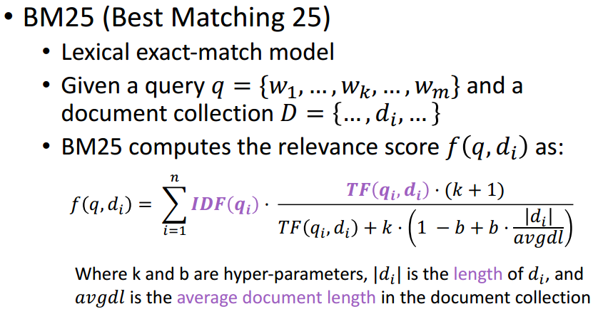

# 通用点:
  - 自我介绍：
    面试官，您好。我是冒志豪，21年毕业于哈尔滨工业大学，目前已经快四年的工作经验。
    第一份工作是在金风科技，主要从事采用一些机器学习的算法来实现新能源风电功率的预测以及
    功率准确性的提升；第二份工作在中兴通讯，
    主要从事构建基于LL的智能运维的Agent系统以及AI机器平台开发的工作,在中兴通讯期间也获得了优秀新员工，
    优秀毕业生的荣誉。
    有三年的python开发基础，对java和前端也有一定的理解。在llm方面，熟悉function calling，对rag和llm微调，
    部署等有一定的了解

  -项目简介：
    我们设计了一套智能运维系统，用户可以通过简单的自然语言交互的能力,获得智能报表，智能分析与诊断，闲聊的功能。
    架构设计上来说，自上而下分为场景Agent->专家Agent->能力Angent。而我们这边主要专注做的是实现能力Agent,
    并将其赋予专家Agent中。
    目前，我们包含了以下几类智能体。查询诊断类（function calling），电信问答（也就是rag），
    文本转SQL，闲聊的功能。我们支持向
    原始的chatgpt直接问答，也可以agent的交互的方式
    从组件交互上来说，我们自上而下是chatbot前端，chatbot后端，aiOps(我们这边实现的)，业务方。
    我主要参与的是查询诊断，也就是functioning calling的功能的设计，这边我们主要是维护一个DSL文件。
    这个LPI文件包含LPI的描述，语义参数，大模型的描述呀，请求体参数，输入，输出，正常和异常返回值呀，权限管理呀.
    关键技术，这边主要两大技术多轮对话下模型微调提升意图理解准确性和槽位提取准确性以及多函数连续调用，
    分支调用功能

  - 如何微调：
    1. 函数查找的微调以及函数参数的微调
    2. 基础语料的准备，数据增强动作。基于prompt做数据增强动作
    3. 人工的校验
    4. 数据的预处理，格式化处理，组装成多轮对话
    5.  LoRa的微调
    6.  模型的评估的工具
    7.  反复迭代
   
  - 准确性如何达到98%
      包含（上述微调工作）
      只取三轮
      函数查找那边是三轮对话
      参数解析那边只有上一轮对话
      对于一些参数处理后处理校验呀
      参数解析处调用两次大模型

  
# 面试


## 阿里钉钉
### 一面
- 简单介绍一下系统
- 三轮对话准确率如何达到98%
- rag如何提高准确率和召回率
- 模型选择
- deepseek跟踪的关键技术
  1. Moe
  2. MLA
  3. MTP
  4. GRPO
  

### 二面
- rag数据安全问题，权限控制
- 为什么只取三轮对话，多轮对话的准确性
  > 我们认为，五轮对话太多，首先用户不知道该如何输出，其次对于模型来说也认识不好理解
- 长短期记忆如何存储的
  >长期记忆中有一个chatbot后端存储，我们内部也会存储一些短期记忆，但更多我们作为的是一个无状态的信息。
- 知识图谱如何实现的
    知识图谱 -------
    首先对pdf，html，word统一处理为一个markdown格式信息的文档
    采用prompt的方式对文档中的信息进行知识抽取，抽取成各自的schema信息,然后将图谱信息存储为向量化信息，最终实现rag的一个检索生成
- 对langchain,llamaxindex了解多少

### 三面
- 端到端的流程，架构设计
- 为什么用微调
- prompt如何书写的
  1. 函数查找
   ```Json
    "select_function":
            '假设你是一个意图分类器，根据上下文判断用户输入属于以下哪一类意图：\n'
            '1. 普通问答：若用户询问的天气、日期、问候等非电信日常生活相关问题，则仅输出“普通问答”4个字。\n'
            '2. 函数调用：若函数集合内某一行可以解决用户输入的内容，函数的专有名词（以**专有名词**）必须准确匹配，则直接回答函数标识即可（例如：Var0）。\n'
            '3. 电信问答：若用户询问计算机、电子信息行业相关、中兴通讯有关设备等问题，则仅输出“电信问答”4个字。如果用户询问内容是百科或者产品功能、特性或者你拥有的功能，也仅输出“电信问答”4个字。如果无法抉择哪个意图，默认输出“电信问答”4个字\n',
    "intent_class":
          '函数集合：\n'
            '{default_intent}\n'
            '{define_intent}'
            '{user_input}',
    ----------------------------------------------
    "select_function_test":
              '假设你是一个函数分类器。请你根据以下函数集合的内容解答用户输入，函数的专有名词（以**专有名词**）必须准确匹配，直接回答函数标识即可（例如：Var0）\n',

    "function_user_test":
      '函数集合：\n'
      '{candidateAPITxt}\n'
      '{user_input}',

  ```
  2. 参数解析
   ```Json
      "parse_parameters":
            '待解析参数如下：\n'
            '{param_description}\n'
            '不同角色对话如下：\n'
            '{history}',
        "parse_system":
            '假设你是一个API的参数解析助手，你的主要任务是根据描述解析当前待解析的参数。要求如下：\n'
            '1. 严格遵守每个参数后面的解释，根据解释填充参数。\n'
            '2. 返回形式是json形式，如果解析成功，则将解析值进行填充；否则填充 "失败"。\n'
            '3. 如果上下文消息冲突，则以最新的用户输入消息为准。\n'
            '4. 每次只关注用户当前输入的待解析参数\n'
            '5. 直接输出结果，不需要解释。\n\n'
            '输出示例：\n'
            '{\n'
            '"变量1": "填充值",\n'
            '"变量2": "填充值"\n'
            '}',

   ```

- 为什么不用一个prompt
  1.  三个方面，从设计上来说。Text2API和函数查找实际上是两个类，抽象出来函数查找，应对更多的场景；
  2.  尽管也可以写在一个prompt里面，但是一个prompt带来的上下文长度过长，耗时不见得会快，对于首token的响应速度应该不如短文本.
  3.  函数查找只是查找到唯一一个函数，但是参数解析的时候存在多个函数连续依赖，连续调用的情况，这种情况prompt会比较复杂，所以选择拆解
  
- rag和知识图谱了解多少
- 承担的角色，团队人数
- 部署的gpu卡，微调的卡
- 未来的规划
- AIGC真的会到来吗
- 最近的热点的技术
  1. deepseek
  2. Manus
  3. 具身智能
- ai可以取代人类吗


## 小鹏汽车
- 设计了哪些Agent
- 未来Agent的设计和发展
- 如何进行模型微调的
- plan功能如何实现
- 如何进行模型评估的
- 准确性提升的一个过程

# 阿里羚羊
  -介绍一下项目
   架构设计上来说，自上而下分为场景Agent->专家Agent->能力Angent

  -历史为什么第一轮不用history，第二轮用history，怎么输入给用户

  -自动评估工具如何测试准确率
  
  -有没有改写用户输入


# 蚂蚁：
### 一面：
  - 层序遍历用哪种结构实现
    - 队列
  - rag的reranker的作用
    --https://luxiangdong.com/2024/02/22/advrag4/
    对文档和查询之间的语义相关性reranker相当于是精确排序
    与Embedding模型不同，重排序模型以查询和上下文作为输入，直接输出相似度分数，而不是Embeddings。
    重要的是要注意，重新排序模型是使用交叉熵损失函数进行优化的，允许不限于特定范围的相关性分数，甚至可以是负的。
    重排方法分为两种：
      重新排序模型
        当前reranker主流模型：
        Cohere 提供的在线模型。 --集成到langchain或者llamx_index之中
        开源模型如 bge-reranker-base 和 bge-reranker-large[1] 
      LLM
        重排任务的微调LLM
        使用提示工程的LLM重排
        训练过程中使用LLM进行数据增强。
  - rag的embdding如何训练
    https://www.luxiangdong.com/2023/09/27/ftembedding/
    https://docs.llamaindex.ai/en/stable/examples/finetuning/embeddings/finetune_embedding/


  - Transform的encoder和decoder的区别
  
  结构上：
  | 模块               | Encoder                 | Decoder                       |
  |-------------------------|------------------------|-----------------------------|
  |self-Attention| 全上下文双向注意力（可见所有输入词）  |       掩码注意力（Masked）（仅可见左侧词）                      |
  | Cross-Attention                | 无           |            有（关注Encoder的输出）                 |
  | 位置编码                | 必需（标记词序）          |         必需（标记生成顺序）                    |
 

 核心功能

  |组件              | Encoder                 | Decoder                       |
  |-------------------------|------------------------|-----------------------------|
  |作用| 	将输入序列编码为上下文相关的表示  |      基于编码器的输出，自回归生成目标序列                      |
  |输入               | 源语言文本（如待翻译的句子）         |    目标语言文本（如翻译结果的前缀）                |
  | 输出                | 隐藏状态（供解码器使用）          |     生成的下一个词或完整序列                    |
  |典型任务               |	文本理解（分类、信息抽取）          |            文本生成（翻译、摘要、对话）                |
 
  - bm25算法的原理
  https://zhuanlan.zhihu.com/p/670322092
  给定一个查询，其中包含相应的单词，BM25会计算**该查询与每一篇文档的匹配分数**。
  

  - NLP常用距离：
    欧式距离
    余弦距离
 
  - 如何提高准确性？
  - 为什么初筛可以达到这个准确性，为啥不考虑语义？怎么提高召回？
  - LoRA的微调的原理
    [高效微调方法](大模型知识/LoRA..ETC.md)

## 高德
- 讲一讲 Transformer 的结构，多头注意力机制的参数量是多少，为什么注意力分数要除以 $\sqrt{dk}$
- RMSNorm 相比 LayerNorm 有什么区别，Pre-Norm 和 Post-Norm 各有什么优劣，现在主流大模型一般用哪种
- 除了多头注意力，还了解哪些注意力的改进，讲一下 GQA 和 MQA。
- DeepSeek-V2 的 MLA 有了解吗，是怎么做的
- 大模型的后训练流程是什么讲一下 LoRA 的原理，参数是怎么初始化的，为什么。
- 除了 LoRA，还了解哪些大模型的微调方法
- leetcode ----72--编辑距离
- 大模型的训练流程是怎样的，目前 RLHF 中主流的强化学习算法有哪些，PPO，DPO 选一个展开讲讲
- 知道哪些在大模型训练或者推理过程中的优化方法，ZeRO、混合精度训练、FlashAttention……
- 知道大模型的参数量是怎么算出来的吗，比如一个 7B 的模型，估算一下参数量
- 目前常用的位置编码有哪些，RoPE 为什么外推性比较好


  
  

  

