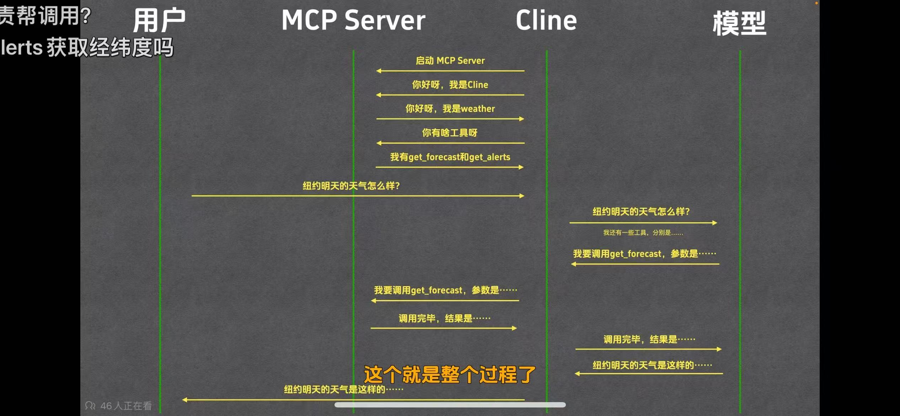

# Function calling
函数调用是一种机制，它允许 LLM 根据用户的输入识别它需要什么工具以及何时调用它。Function calling主要通过SFT实现，而不是在预训练阶段从零开始训练。

Function calling的发生过程在上图中**OpenAI服务器与GPT-4o**之间的关系

# MCP协议

MCP（即模型上下文协议,Model Context Protocol）试图标准化此过程。

# Function calling和mcp的区别
函数调用侧重于模型想要做什么，而 MCP 侧重于如何使工具可被发现和可消费，尤其是在多个代理、模型或平台之间。

MCP 不是在每个应用程序或代理中硬连接工具，而是：

- 标准化了工具的定义、托管和向 LLM 公开的方式，**相当于注册功能**。
- 使 LLM 能够轻松发现可用工具、了解其架构并使用它们。
- 在调用工具之前提供审批和审计工作流程。
- 将工具实施的关注与消费分开。

