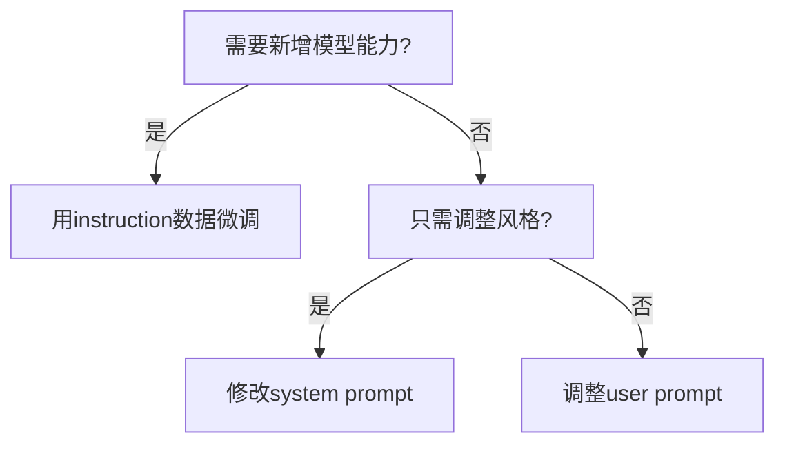

本人主要进行监督微调相关的工作，所以此处着重说明一下监督微调相关的内容。

# Alpaca格式
## 基本格式结构
```
[
  {
    "instruction": "人类指令（必填）",
    "input": "人类输入（选填）",
    "output": "模型回答（必填）",
    "system": "系统提示词（选填）",
    "history": [
      ["第一轮指令（选填）", "第一轮回答（选填）"],
      ["第二轮指令（选填）", "第二轮回答（选填）"]
    ]
  }
]
```

## 举例说明
下面提供一个 alpaca 格式 多轮 对话的例子，对于**单轮对话只需省略 history 列即可。**

```
[
  {
    "instruction": "今天的天气怎么样？",
    "input": "",
    "output": "今天的天气不错，是晴天。",
    "history": [
      [
        "今天会下雨吗？",
        "今天不会下雨，是个好天气。"
      ],
      [
        "今天适合出去玩吗？",
        "非常适合，空气质量很好。"
      ]
    ]
  }
]

对于上述格式的数据， dataset_info.json 中的 数据集描述 应为：
```
"数据集名称": {
  "file_name": "data.json",
  "columns": {
    "prompt": "instruction",
    "query": "input",
    "response": "output",
    "system": "system",
    "history": "history"
  }
}
```

```
## 详细说明

| 字段        | 作用                             | 类比                         | 是否必填 |
|-------------|----------------------------------|------------------------------|-----------|
| `instruction` | 告诉模型要做什么任务               | 老师布置的作业题目             | 必填      |
| `input`         | 任务需要的额外信息或上下文         | 作业的题干或附加材料           | 可选      |
| `output`        | 模型应该生成的理想答案             | 老师提供的标准答案             | 必填      |

**案例1：**翻译任务
```
{
  "instruction": "将以下句子翻译成英文",
  "input": "今天天气真好",
  "output": "The weather is so nice today."
}
```

**案例2：**无需上下文的问答
```
{
  "instruction": "解释牛顿第一定律",
  "input": "",
  "output": "牛顿第一定律又称惯性定律，指物体在不受外力作用时保持静止或匀速直线运动状态。"
}
```

**案例3：**带条件的创作
```
{
  "instruction": "写一封正式辞职信",
  "input": "工作满3年，原因是要出国留学",
  "output": "尊敬的领导：因本人计划赴海外深造，现申请于下月底正式离职..."
}
```

## 常见误区澄清
❌ 误区1：把 instruction 和 input 混为一谈
✅ 正确理解：
- instruction = 任务类型（如翻译/总结/写邮件）
- input = 任务对象（如待翻译的句子/待总结的文本）
❌ 误区2：在不需要上下文时强行填 input
✅ 正确做法：若任务本身已完整（如“列举10种水果”），input 应为空字符串 ""。


**system和instruction的区分**
举例说明

| 方案             | 实现方式                                       | 效果差异                                   |
|------------------|-----------------------------------------------|------------------------------------------|
| `instruction`格式 | `{"instruction":"写七言诗","input":"主题：春天","output":"春眠不觉晓..."}` | 能微调出稳定的写诗能力                     |
| system prompt     | `system`: "你是一位唐代诗人"                   | 只能影响风格，无法保证执行力                |

**关键结论：**
- `instruction` 是任务能力注入。
- `system` 是风格调节旋钮。




# 参考
  https://llamafactory.readthedocs.io/zh-cn/latest/getting_started/data_preparation.html#openai