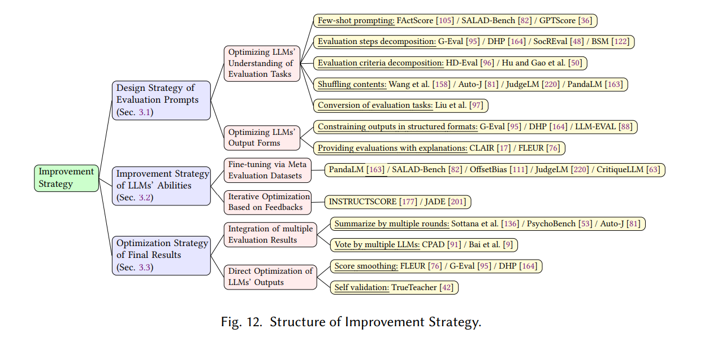
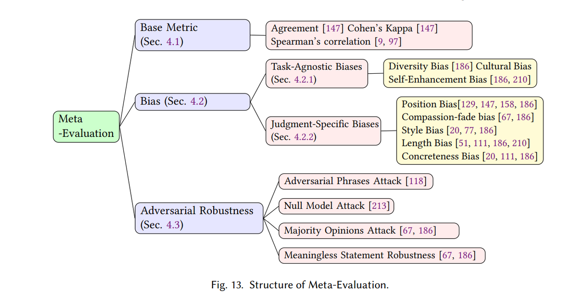
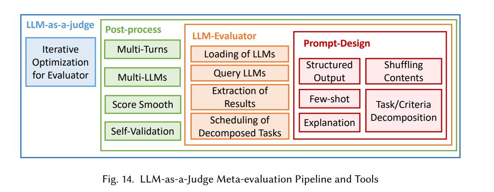
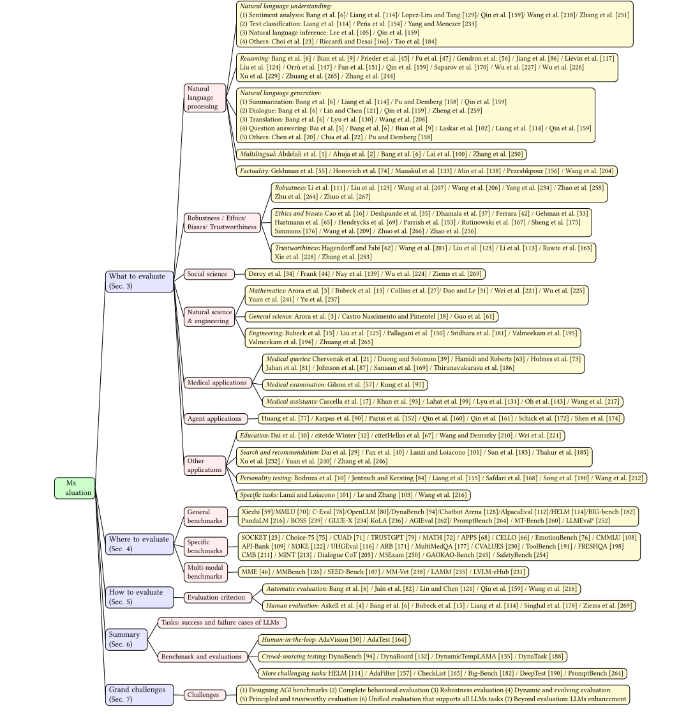

# 大模型评估调研
## 评估方法
- 主观评估（专家评估）
- 客观评估
  - BLEU
  - ROUGE 
- LLM评测
## 构建LLM评测
输入设计、模型选择和训练，以及输出后处理---评估
- 输入设计和提示设计
  - 对于输入设计，需要考虑要评估的变量类型（如文本、图像或视频）、输入方式（例如单独、成对或批量）及其位置（例如在开头、中间或结尾）。对于提示设计，可以采用四种不同的方法。这些方法包括生成分数、解决真/假问题、进行成对比较和进行多项选择。
- 模型选择
  - 外部现有大模型
  - 微调模型
    - 数据收集
      - 指令、待评估对象和评估结果(更大模型打标或者人工打标）
    - 提示
    - 模型微调
- 后处理（评估格式和输入设计一样）
  - 提取特定标记
    - 保证每个输入和最终评估相同（比如，需要修改吗，需要和不需要，yes和no）
    - constrained decoding
  - 归一化输出 logits 
  - 选择高回报的句子
- 模型评估
  - 用于模型
  - 用于数据
    - 评估生成高质量数据
  - 用于代理
  - 用于推理或者思考
## 改进

LLM存在固有的长度偏差，具体性偏差和知识偏差
- 评估提示的设计策略（基于情境学习）
  - fewshot
  - 拆解评估任务
  - 成对任务的时候会出现位置偏差（裁判会倾向于左边跑道或者右边跑道，多次评分）
  - 格式化输出
- LLMs 评估能力的改进策略（基于模型）
  - 微调评测模型
  - 评估迭代优化（基于更大的模型或者人工评估结果评测）
- 最终评估结果的优化策略（基于后处理）
  - 整合多个结果
    - 调整温度和超参数
    - 使用多个LLM（多个模型融合）
  - 优化LLM输出
    - 自我反思
      2. 第一次评估： LLM对答案A和B进行评估，输出结果（例如“A更好”）。
      3. 自我验证： 我们向同一个LLM出示一个新的提示，包含：
        1. 原始问题
        2. 答案A和B
        3. 它自己刚才给出的评估结果
        4. 然后询问：“你对这个判断结果有多确定？”或者“请检查这个判断是否合理？”
      4. 过滤结果：
        1. 如果LLM表示“非常确定”或认为判断合理，我们就保留这个评估结果。
    - 评分平滑（窥探内心）
FLEUR的评分平滑策略是如何工作的？
假设我们让LLM在一个0-9的尺度上打分。
2. 显式评分： LLM最终输出了数字“7”。
3. 窥探内心： 我们不去看最终的“7”，而是去看在生成这个分数时，模型为所有可能数字（0,1,2,...,9）对应的token所计算出的概率。
  1. 可能的情况是：P(‘6’ token) = 0.25， P(‘7’ token) = 0.60， P(‘8’ token) = 0.15
4. 平滑计算： 我们不直接采用“7”，而是用这些概率作为权重，计算一个加权平均分。
  1. 最终评分 = (6 * 0.25) + (7 * 0.60) + (8 * 0.15) = 6.9
- 评估任务逐点评估转为成对比较
 
## 评估评估器优劣

LLM存在幻觉，导致评估结果不理想。
### 基础指标
一致性(依赖LLM生成和人类判断的数据集,所以需要构建）
sum（人工=机器）/总数据集
kappa
spearmans
准确率，召回率，F1分数
 
### 偏见
任务无关
特定于判断的偏差
 
### 鲁棒性
 
 
 
 
 
## 实验

### 评估维度和基准
人工对齐
llmeval  https://github.com/AlibabaResearch/DAMO-ConvAI/tree/main/WideDeep
偏差
EVALBIASBENCH  https://github.com/ncsoft/offsetbias-
 
### 评估指标
#### 一致性
用于对齐人工
#### 准确率
除位置偏差歪歪的偏差，使用准确率进行评估，表示LLM作为评判者选择EVALBIASBENCH 中标注的正确候选回复样本的比例。
#### 位置一致性
交互评估顺序，认为两次打分是否相同
- 将所有 N 个样本的指示函数返回值相加，得到总共有多少个样本的评估结果是一致的。
- 将这个总和除以总样本数 N，得到一个介于 0 和 1 之间的比率，这就是位置一致性。
 
 
## 评估范围

核心能力：
- 推理能力
  - 逻辑
  - 数学
  - 常识
  - 多跳
  - 结构化数据推理
- 社会影响
  - 安全性
  - 可信度
- 特定领域知识
  - 金融
 
 
 
 
 
## 参考
https://github.com/onejune2018/Awesome-LLM-Eval
https://arxiv.org/abs/2411.15594
https://dl.acm.org/doi/full/10.1145/3641289
https://zhuanlan.zhihu.com/p/18593955786
https://github.com/MLGroupJLU/LLM-eval-survey