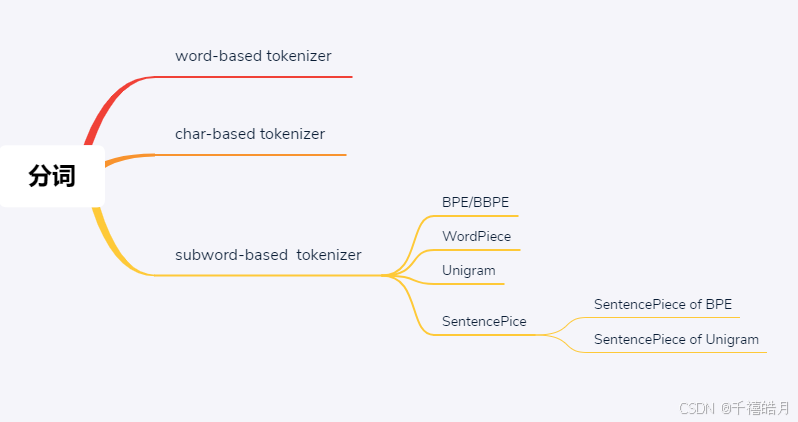
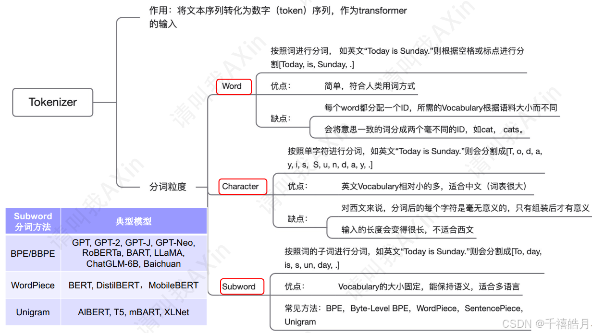

# NLP中的论文
## BERT原理
双层transorformer结构

CLS   与此词对应的最终隐藏状态被用作分类任务的序列聚合表示
SEP   用于分割

## bert微调
### 输入输出
输入序列，句子分段标记   ------ 任务目标
 

BERT4Rec: Sequential recommendation with bidirectional encoder representations from transformer 


## 框架


uer-py 是由 DIIR 实验室开源的一个 Python 实现的预训练语言模型集合。它的核心特点是模块化设计，集成了多种预训练模型，如 BERT、RoBERTa、ALBERT 等，并提供统一的接口，方便使用者在不同模型之间切换。uer-py 还支持自定义模型架构和预训练任务，包含丰富的数据处理工具，可用于文本分类、命名实体识别、机器翻译、问答系统等多种自然语言处理任务。

[uer-py](https://github.com/dbiir/UER-py/)

TextBrewer  实现模型蒸馏的功能   
[textBrewer](https://github.com/dbiir/UER-py#)


# NLP流水线
```
原始文本 → [SentencePiece 分词] → Token 序列 → [Embedding 层] → 向量序列 → [模型其他层（如注意力层）] → 最终输出（分类、翻译等）

```

# LLM中分词方法





参考文章：[LLM中分词方法](https://blog.csdn.net/qq_46018418/article/details/141647821)


# embedding选择
word
pos
seg
sinusoidalpos
dual


# 模型的评估与选择
好的，我们来详细、清晰地解释一下准确率（Precision）和召回率（Recall）这两个在机器学习和数据挖掘中至关重要的评估指标。

核心思想：不同的关注点
想象一个捕鱼的情景：

准确率关心的是： 你捞上来的鱼里，有多少是真正的目标鱼（比如金枪鱼）？它追求的是“宁缺毋滥”。
召回率关心的是： 整个池塘里所有的目标鱼（金枪鱼），你捞上来了多少？它追求的是“宁可错杀，不可放过”。
这两个指标通常是一对矛盾体。提高准确率可能会降低召回率（更挑剔，捞得更少），提高召回率可能会降低准确率（撒大网，捞上很多杂鱼）。

极端情况考虑：、
- 我把鱼全部捕获出来，那么召回就是100%，但是准确率会不高；
- 假设我只捞取一条金枪鱼，那么准确率是100%，召回不足（因为鱼塘还有很多其他的鱼）

| 指标 | 公式 | 关注点 | 通俗解释 | 应用场景 |
|:---|:---|:---|:---|:---|
| **准确率 (Precision)** | $\frac{TP}{TP + FP}$ | **预测为正的样本**中有多少是**真的正样本** | 你**捞上来的鱼**里，有多少是**你想要的目标鱼** | 垃圾邮件识别、推荐系统 防止错报 \n  准确率非常高（推荐的内容用户基本都喜欢），但召回率会较低（很多用户可能也喜欢的内容没有被推荐出来，即FN漏报很多） |
| **召回率 (Recall)** | $\frac{TP}{TP + FN}$ | **所有真正的正样本**中，有多少**被预测出来了** | **整个池塘里**所有的目标鱼，你**捞上来了多少** | 疾病筛查、安全隐患检测  防止漏报 召回率非常高（几乎所有的病人都被找出来了），但准确率会很低（很多健康人被误诊为癌症，即FP误报很多）|
| **F1分数 (F1-Score)** | $2 \times \frac{Precision \times Recall}{Precision + Recall}$ | **准确率**和**召回率**的**调和平均数**、**综合性能** | **既不放过太多鱼，也不捞太多垃圾**的**平衡点** | 需要综合评估模型性能的场景 |


# 中文常见分词工具

| 特性               | Jieba                          | HanLP                          |
|--------------------|-------------------------------|--------------------------------|
| **分词算法**       | 基于词典匹配（Trie树）         | 混合模型（词典+深度学习）       |
| **功能范围**       | 基础分词、关键词提取、词性标注 | 分词、NER、句法分析、语义分析等 |
| **未登录词处理**   | 较弱                           | 较强（依赖深度学习模型）        |
| **性能**           | 轻量级，适合小规模数据         | 适合大规模数据，但资源消耗高    |
| **语言支持**       | 中文                           | 多语言（中、英、日等）          |
| **使用难度**       | 简单                           | 中等（需配置模型和依赖）        |
| **典型应用场景**   | 快速分词、小型项目             | 工业级 NLP 任务、复杂文本分析   |

## jieba


## HanLP


# 评估
CLUE