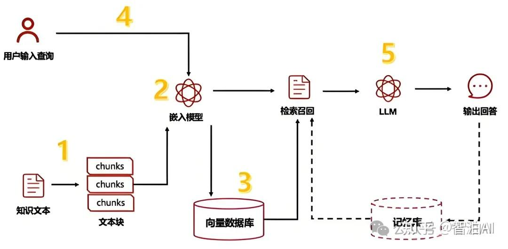
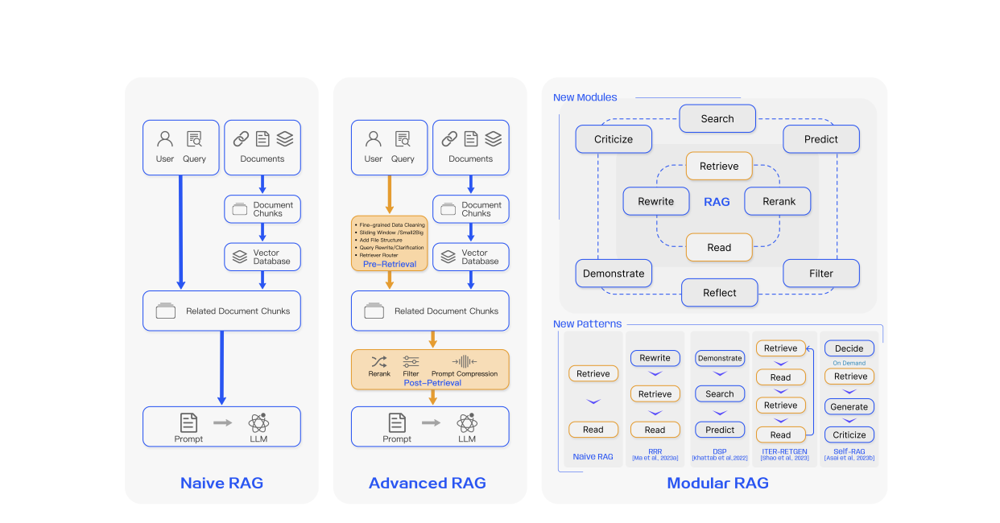
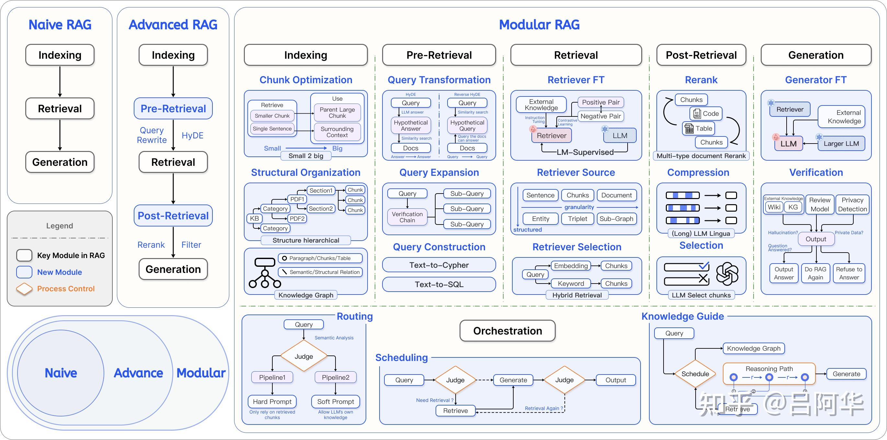

# RAG基础知识
RAG 检索生成增强 



不同RAG的对比


不同RAG的详细的对比


**高级RAG可以视为模块化RAG的一个特例**

# RAG中可以优化的点
对比图示感觉每个模块都可以优化

# RAG求流程
## 使用llamax_index构建RAG
```
class RagAgent(BaseAgent):
    def __init__(
        self,
        name="RagAgent",
        description="用于作为rag检索的agent",
        model_path="",
        device=None,
        router = False
    ):
        super().__init__()
        self.name = name
        self.description = description
        self.model_path = model_path
        self.device = device
        self.direct_llm_intent = (AsyncLLM("qwen3_32b"),)
        self.router = router
        self._index_cache = {}


    def build_rag_index(self, datas: str, storage_path: str = "") -> BaseIndex:
        if storage_path in self._index_cache:
            return self._index_cache[storage_path]
        if len(os.listdir(storage_path)) == 0:
            documents = [Document(text=data) for data in datas]
            parser = SimpleNodeParser.from_defaults(chunk_size=1024, chunk_overlap=20)
            nodes = parser.get_nodes_from_documents(documents)
            index = VectorStoreIndex(
                nodes=nodes, embed_model=embed_model, show_progress=True
            )

            index.storage_context.persist(persist_dir=storage_path)
        else:
            storage_context = StorageContext.from_defaults(persist_dir=storage_path)
            index = load_index_from_storage(storage_context)
        self._index_cache[storage_path] = index
        logger.info("意图库索引构建成功")
        return index

    async def first_screen_with_rag(
        self, user_input, reference, storage_path: str = "",top = 20
    ) -> List[str]:
        try:
            logger.debug(f"用于rag初筛的文本为{user_input}")
            storage_path = storage_path if storage_path else STORAGE_PATH
            index = self.build_rag_index(reference, storage_path=storage_path)
            embedding_retriever = create_embedding_retriever(index, similarity_top_k=20)
            bm25_retriever = create_bm25_retriever(index, similarity_top_k=20)

            if self.router:
                reranker = SentenceTransformerRerank(
                    model="/data/oceanus_ctr/j-maozhihao-jk/models/bge-reranker-base", top_n= top# 返回前 3 个最相关的节点
                )
                embedding_bm25_retriever_rerank = EmbeddingBM25RerankerRetriever(
                    embedding_retriever, bm25_retriever, reranker=reranker
                )
                nodes = embedding_bm25_retriever_rerank.retrieve(user_input)

            else:
                nodes = embedding_retriever.retrieve(user_input)
            result = [node.text for node in nodes]
        except Exception:
            logger.error(f"user_input is {user_input}")
            result = ["检索失败"]
        return result


if __name__ == "__main__":

    agent = RagAgent(router = True)
    user_input = "我就是不还钱，你能把我怎么样"
```

# 参考
https://zhuanlan.zhihu.com/p/673392898