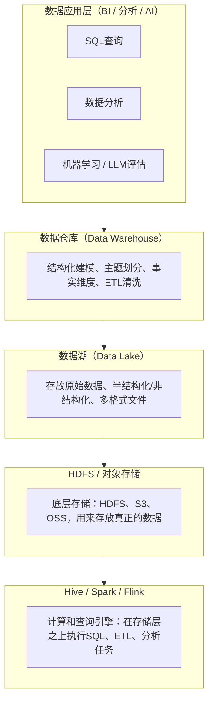

# 基本概念



# 🌐 大数据核心概念解析

## 🧱 1. HDFS（Hadoop Distributed File System）

**定义**：
HDFS 是 Hadoop 生态系统的**分布式文件系统**，用于在普通服务器集群上存储超大规模数据。

**核心特性**：

- **分布式存储**：数据被切分成块（通常为 128MB 或 256MB），分布存储在多台机器上。
- **容错性强**：每个数据块会被复制多份（默认 3 份），防止节点宕机导致数据丢失。
- **高吞吐量**：为大文件的顺序读写而优化，不适合随机读写小文件。
- **计算靠近数据**：计算任务（如 MapReduce）通常在数据所在节点上执行，减少网络传输。

**应用场景**：

- 存储原始日志、图片、音视频文件、结构化或非结构化大数据。

---

## 🐝 2. Hive（Hadoop-based Data Warehouse）

**定义**：
Hive 是建立在 Hadoop 之上的**数据仓库工具**，可以将存储在 HDFS 中的数据映射为表结构，通过 **类 SQL（HiveQL）** 语句进行分析。

**核心特性**：

- **SQL接口**：让非程序员也能通过 SQL 操作大数据。
- **底层执行引擎**：将 HiveQL 转换为 MapReduce、Tez 或 Spark 任务执行。
- **面向离线分析**：不适合低延迟查询，适合批量统计、聚合、ETL 等任务。
- **Schema on Read**：数据在加载时不强制定义结构，而是在查询时解释结构。

**应用场景**：

- 日志分析、用户行为统计、离线报表。

---

## 🗄️ 3. 数据库（Database）

**定义**：
数据库是**存储、管理和访问结构化数据**的软件系统。最常见的类型是关系型数据库（RDBMS）。

**核心特性**：

- **结构化存储**：数据以表格形式存储，表之间存在关系。
- **事务支持（ACID）**：保证数据一致性与可靠性。
- **实时读写**：支持高频的插入、更新、删除、查询操作。
- **常见系统**：MySQL、PostgreSQL、Oracle、SQL Server。

**应用场景**：

- 业务系统（如电商、CRM、银行系统）的在线数据存储与访问。

---

## 🏗️ 4. 数据仓库（Data Warehouse, DW）

**定义**：
数据仓库是面向分析的、整合型的、随时间变化的**主题数据集合**，用于支持企业的决策分析。

**核心特性**：

- **面向主题（Subject-Oriented）**：按业务主题组织（如客户、销售、产品）。
- **集成性（Integrated）**：整合来自不同业务系统的数据。
- **随时间变化（Time-Variant）**：保留历史数据，用于趋势分析。
- **非易失性（Non-Volatile）**：数据加载后通常不再被修改。

**技术实现**：

- 可以基于 Hive、Spark SQL、ClickHouse、Snowflake、Redshift 等实现。
- 数据模型常采用 **星型模型** 或 **雪花模型**。

**应用场景**：

- 报表分析、KPI 指标计算、OLAP 多维分析。

---

## 🌊 5. 数据湖（Data Lake）

**定义**：
数据湖是一个集中式存储平台，能够以**原始格式**存放来自不同来源的**结构化、半结构化、非结构化数据**。

**核心特性**：

- **存储一切类型的数据**：文本、图片、日志、传感器数据等。
- **Schema on Read**：查询时再定义数据结构。
- **成本低**：通常构建在对象存储或分布式文件系统上（如 HDFS、S3）。
- **支持多种计算引擎**：Spark、Presto、Flink、Trino、Hive、LLM 等。

**典型架构**：

**应用场景**：

- 机器学习训练数据集管理
- 大规模日志归档与分析
- 数据探索与可视化分析

---

## 📊 概念对比表

| 概念     | 类型           | 数据结构             | 读写特性                 | 适用场景               | 典型技术                    |
| -------- | -------------- | -------------------- | ------------------------ | ---------------------- | --------------------------- |
| HDFS     | 分布式文件系统 | 任意格式             | 高吞吐量，顺序读写       | 大数据存储、日志归档   | Hadoop                      |
| Hive     | 数据仓库工具   | 表（结构化）         | 批量分析，离线查询       | 离线统计、报表分析     | HiveQL + Hadoop/Spark       |
| 数据库   | 数据管理系统   | 表（关系型）         | 实时读写，事务支持       | 业务系统、在线服务     | MySQL, PostgreSQL, Oracle   |
| 数据仓库 | 分析型存储     | 表（结构化，主题化） | 批量加载，历史数据分析   | BI 报表、OLAP 多维分析 | Hive, ClickHouse, Snowflake |
| 数据湖   | 集中式存储平台 | 任意格式             | Schema on Read，灵活计算 | 数据探索、ML、归档     | HDFS, S3, Spark, Presto     |

# 💡 电商企业数据管理场景示例

## 场景背景

假设我们有一个大型电商平台，包含以下数据：

- 用户行为日志（点击、浏览、搜索）
- 订单数据（下单时间、商品、金额）
- 产品信息（SKU、库存、价格）
- 用户信息（注册信息、偏好）

企业希望实现：

1. 实时交易处理（订单创建、库存扣减）
2. 日常业务分析（销售报表、用户行为分析）
3. 机器学习模型训练（推荐系统、用户画像）

---

## 各概念的应用

### 1. HDFS

- **作用**：存储原始日志和大文件
- **示例**：
  - 用户行为日志每天产生几 TB，存放在 HDFS 上。
  - 日志包括点击时间、用户ID、商品ID、页面来源等。
- **特点体现**：
  - 分布式存储大文件，容错高。
  - 支持离线批量分析。

### 2. Hive

- **作用**：对 HDFS 中的原始日志或结构化数据进行分析
- **示例**：
  - 将用户行为日志映射成 Hive 表：
    ```sql
    CREATE TABLE user_logs (
        user_id STRING,
        event_time TIMESTAMP,
        page_id STRING,
        product_id STRING
    )
    ROW FORMAT DELIMITED
    FIELDS TERMINATED BY ',';
    ```
  - 使用 HiveQL 统计每日活跃用户（DAU）：
    ```sql
    SELECT COUNT(DISTINCT user_id)
    FROM user_logs
    WHERE event_time >= '2025-10-01' AND event_time < '2025-10-02';
    ```
- **特点体现**：
  - SQL 接口让数据分析更简单。
  - 面向离线大数据统计。

### 3. 数据库

- **作用**：存储业务系统的**实时数据**
- **示例**：
  - 订单数据库：
    - 表 `orders`：order_id, user_id, product_id, amount, status
    - 表 `users`：user_id, name, email, registration_date
  - 当用户下单时，数据库实时更新订单状态和库存。
- **特点体现**：
  - 支持事务（ACID），保证订单处理准确。
  - 实时读写，高并发。

### 4. 数据仓库

- **作用**：存储经过清洗、整合的**分析型数据**，区别于数据库的实时数据
- **示例**：
  - 将订单数据和用户数据整合到数据仓库，用于销售报表：
    - 表 `daily_sales`：date, product_id, total_sales, total_orders
    - 表 `user_activity`：date, user_id, active_events
- **特点体现**：
  - 按主题建模，便于分析。
  - 保留历史数据用于趋势分析。
  - 面向决策支持和 BI 报表。

### 5. 数据湖

- **作用**：存放各种结构化、半结构化、非结构化数据
- **示例**：
  - 除了日志和订单外，还存储：
    - 产品图片、视频
    - 客服聊天记录
    - 用户评论 JSON 文件
  - 数据科学家可以从数据湖直接获取原始数据，进行机器学习模型训练：
    ```python
    import pyspark
    df = spark.read.json("s3://ecommerce-datalake/user_comments/")
    ```
- **特点体现**：
  - 支持多种数据格式和计算引擎。
  - Schema on Read，灵活分析和探索。

---

## 🔄 数据流总结

1. 用户操作 → 数据生成 → 写入 HDFS（日志）
2. Hive 分析 HDFS 数据，生成报表指标
3. 实时订单写入数据库，保证事务一致性
4. 数据仓库从数据库和 Hive ETL 数据，支持 BI 报表
5. 数据湖汇总所有数据（日志、图片、评论等），支撑 ML 和探索分析

---

## 📊 总结表格

| 概念     | 数据类型     | 用途          | 示例                   |
| -------- | ------------ | ------------- | ---------------------- |
| HDFS     | 原始大数据   | 批量存储      | 用户行为日志           |
| Hive     | 结构化表     | 离线分析      | DAU统计、点击量分析    |
| 数据库   | 关系型数据   | 实时业务      | 订单、库存、用户信息   |
| 数据仓库 | 清洗整合数据 | 决策分析      | 日销售报表、用户活跃表 |
| 数据湖   | 任意格式数据 | 数据探索 & ML | 图片、视频、评论 JSON  |

# 其他

## **sql命令**

数据库的执行顺序：`JOIN` **->** `WHERE` **过滤 ->** **`DISTINCT` **去重**** **->** `ORDER BY` **->** `LIMIT`

```
SELECT
  DISTINCT 
    p.call_id,                    -- 呼叫ID号
    p.action_time,
    p.case_code,                  -- 案件号
    p.cust_no,                    -- 客户编号
    p.over_due_days,
    p.ring_label,                 -- 响铃识别类型
    p.sex,
    p.age,
    p.actor_type,                 -- 行动类型
    p.action_type,
    p.call_type,                  -- 呼叫类型
    p.talk_time,
    p.is_call_rela,               -- 是否呼叫三方
    p.total_overdue_amt,          -- 逾期总额
    p.remaining_amt,              -- 剩余本金
    p.total_arrears_amt,          -- 欠款总额
    p.loan_amt,                   -- 借款金额
    p.cust_address,               -- 户籍地址
    p.mobileno_belong_area,       -- 手机号归属地址
    o.audio_name,
    o.call_time ,
    a.date,
    a.channel,
    a.starttime,
    a.endtime,
    a.text,
    c.queue_id,
    c.machine_score
FROM
  fin_dm_data_ai.dm_eco_coll_wide_case_dim_pdi p      -- 机器人宽表
JOIN
  fin_dw.dwd_coll_outbound_call_list_pda o           -- 对话关联数据
  ON p.case_code = o.case_code 
  AND p.call_id = o.call_id
  AND o.pday = '20260225'                            --将分区条件移至 JOIN 条件中，有助于剪枝优化
JOIN
  hdp_credit.prd_es_intelget_voice_anlys_cuishou a    --真实语音数据
  ON o.audio_name = a.name
JOIN
  ods.prd_intelget_voice_iv_qi_info c    -- 机器人质检数据
  ON a.name = c.audio_name
WHERE
  p.actor_type = '人工'
  AND p.is_connect = TRUE
  AND p.talk_time > 0
  AND p.case_code = '120260129000029038'
  AND p.pday >= '20260222'        -- 注意：此处范围较大，确认是否需要限制上限
  AND c.machine_score = 100
  AND c.is_personal = 1          -- 是否是本人
  AND c.call_type = 1            -- 录音呼出
ORDER BY 
  o.audio_name DESC              -- audio_name整体已经排序了，但是组内没有排序
LIMIT 1000000;
```


hdfs和本地环境之间的联系
