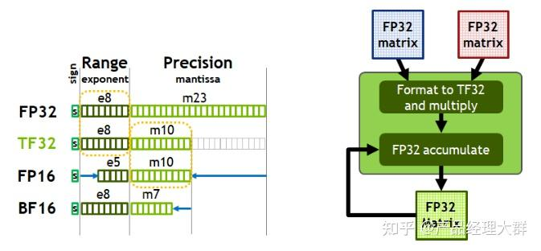
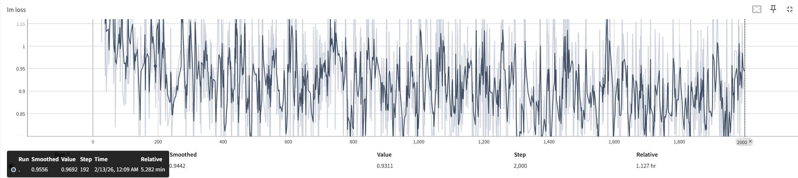
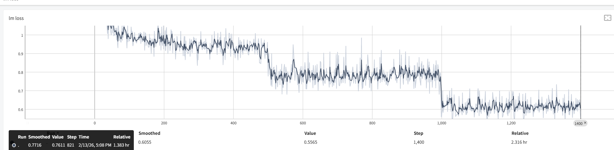

## 基础知识

### 基本概念

#### 读懂config.json文件

```
torch_dtype 是“出身成分”（原始模型是 BF16 的），而 quantization_config 是“当前状态”（现在为了高效运行，已经穿上了 FP8 的装备）。推理引擎会听从 quantization_config 的指挥.

{
  "architectures": [
    "Qwen3ForCausalLM"  
  ],
  "attention_bias": false,
  "attention_dropout": 0.0,
  "bos_token_id": 151643,
  "eos_token_id": 151645,
  "head_dim": 128,
  "hidden_act": "silu",
  "hidden_size": 5120,
  "initializer_range": 0.02,
  "intermediate_size": 25600,
  "max_position_embeddings": 40960,
  "max_window_layers": 64,
  "model_type": "qwen3",
  "num_attention_heads": 64,
  "num_hidden_layers": 64,
  "num_key_value_heads": 8,
  "rms_norm_eps": 1e-06,
  "rope_scaling": null,
  "rope_theta": 1000000,
  "sliding_window": null,
  "tie_word_embeddings": false,
  "torch_dtype": "bfloat16",                      ##训练逻辑精度
  "transformers_version": "4.51.0",
  "use_cache": true,
  "use_sliding_window": false,
  "vocab_size": 151936,
  "quantization_config": {     ## 虽然逻辑上是 BF16 模型，但：权重 不按 BF16 存而是 压成 FP8（E4M3）存每 128×128 一个 block，有 scale / amax
    "activation_scheme": "dynamic",
    "fmt": "e4m3",
    "quant_method": "fp8",
    "weight_block_size": [
      128,
      128
    ]
  }
```

| 字段                | 回答的问题                         |
| ------------------- | ---------------------------------- |
| torch_dtype         | “从训练逻辑上看，这是什么模型？” |
| quantization_config | “权重在显存里怎么放？”           |
| TransformerEngine   | “算子怎么跑最快？”               |

```plaintext
FP8 权重（存储）
   ↓ TransformerEngine 自动反量化
BF16 / FP16 计算接口
   ↓ FP8 TensorCore
BF16 输出
```

#### 大模型显存组成

* **可估算值** ：模型参数（parameter）、优化器状态值（optimizer_state）、激活值（activation）、梯度值（gradient）、输出数据（input）
* **未命名数据** ：临时变量（temporary）、未知数据（unknown)
* **其他（框架）** ：自动梯度（autograd_detail）

优化器：

    要一个Momentum和一个Variance状态参数，在混合精度训练中Adam还有一份**模型参数副本**

[LLM]大模型显存计算公式与优化 - kaiyuan的文章 - 知乎
https://zhuanlan.zhihu.com/p/687226668

举例说明

* 模型：**7B**
* 精度：**2 字节）**
* 序列长度：**8192**
* 单卡 batch：**1**
* 优化器：**AdamW**

| 显存部分        | 计算逻辑                          | 大小   | 占比  | 关键说明                      |
| --------------- | --------------------------------- | ------ | ----- | ----------------------------- |
| 模型参数        | 7B × 2 字节                      | 13 GB  | 8.3%  | 模型权重本身                  |
| 激活值          | 1×8192×4096×32×2              | 20 GB  | 12.7% | 8192 长序列的核心显存大户     |
| 梯度            | 和模型参数等大（7B×2 字节）      | 13 GB  | 8.3%  | 反向传播生成，维度 = 参数维度 |
| 优化器状态      | AdamW = 参数 ×8（含动量 / 方差） | 104 GB | 66.2% | 显存占比最高的部分            |
| 临时张量 / 通信 | 前 4 项总和 ×10%                 | 15 GB  | 4.5%  | 损失计算、多卡通信等临时数据  |

#### 大模型精度：FP32、TF32、FP16、BF16、FP8、FP4、NF4、INT8

FP32（单精度浮点）= 4 字节（Byte）

FP16（半精度浮点）= 2 字节

INT8（量化）= 1 字节

INT4（量化）= 0.5 字节

| 格式     | 符号位 | 指数位 | 小数位 | 总位数 |
| -------- | ------ | ------ | ------ | ------ |
| FP64     | 1      | 11     | 52     | 64     |
| FP32     | 1      | 8      | 23     | 32     |
| FP16     | 1      | 5      | 10     | 16     |
| FP8 E4M3 | 1      | 4      | 3      | 8      |
| FP8 E5M2 | 1      | 5      | 2      | 8      |
| FP4      | 1      | 2      | 1      | 4      |



大模型精度：FP32、TF32、FP16、BF16、FP8、FP4、NF4、INT8 - AI产品经理大群的文章 - 知乎
https://zhuanlan.zhihu.com/p/1912129762048074069

#### allreduce :

`allreduce` 是分布式通信中的 **核心集体操作（Collective Operation）** ，你可以把它理解成：

> 多个 GPU / 进程各自有一个数值（比如梯度），通过 `allreduce` 操作，先把所有数值汇总（求和 / 求平均），再把汇总结果同步给每一个 GPU / 进程，最终所有 GPU 拿到的都是同一个汇总值。

举个最直观的例子（对应你之前 8 卡训练的场景）：

* GPU0 有梯度值：`[1, 2]`
* GPU1 有梯度值：`[3, 4]`
* ...
* GPU7 有梯度值：`[15, 16]`
* 执行 `allreduce(sum)` 后，所有 GPU 都会得到：`[1+3+...+15, 2+4+...+16] = [64, 72]`
* 如果是 `allreduce(mean)`，所有 GPU 会得到：`[64/8, 72/8] = [8, 9]`

### 并行策略

#### 数据并行（DP)

每张卡拷贝相同的模型结构，仅对数据做切分。每张卡计算完的梯度也是针对各自数据的，需要做一次allreduce，然后使用优化器更新模型，进入下一次迭代。

**数据并行大小** **(DP)** **=** **总GPU数** **/** **(TP** **×** **PP** **×** **CP)**

#### 模型并行

#### 流水线并行（PP）

#### 张量并行（TP）

#### 序列并行(sequence_parallel，SP)

#### 上下文并行（context_parallel,CP）

#### 专家模型并行（expert_model_parallel,EP)

数据并行的大小与与expert_model_parallel_size 没关系

#### 专家张量并行（expert_tensor_parallel

**TP解决“胖模型”，SP解决“长文本”**

### 大模型训练加速框架

#### Megatron-LM

这是一个基于 NVIDIA Megatron-LM 框架训练的模型

#### deepspeed

微软开发

https://www.zhihu.com/search?type=content&q=Megatron-LM%20%E3%80%81

151936 -千问的词表

**假设：**

* `micro_batch_size = 1`
* `seq_length = 8192`
* **全是有效 token（无 padding）→** `s10 = 8192`

```
buf9 size =8192 × 1 × 151936 × 4bytes
          ≈ 8192 × 151936 × 4/(1024^3) ≈ **4.63 GiB**
```

**`真好匹配日志  Tried to allocate 4.63 GiB`**

packing

### NCLL的通信优先级：

NVLink/NVSwitch（GPU间直连） > 共享内存（SHM） > RDMA网卡 > TCP/IP

## 训练过程

### swift训练过程中的记录

self.lr_warmup_steps < self.lr_decay_steps

self.lr_warmup_steps不设置的时候默认是train_step

micro_batch_size: 每个device的批次大小，默认为1。

global_batch_size: 总批次大小，**等价于micro_batch_size *数据并行大小**梯度累加步数**

cross_entropy_loss_fusion

* recompute_granularity: 重新计算激活的粒度，可选项为'full', 'selective' and 'none'（其中'none'为 ms-swift>=3.12.3支持）。其中full代表重新计算整个transformer layer，selective代表只计算transformer layer中的核心注意力部分。通常'selective'是推荐的。默认为'selective'。

  * 当你设置为'selective'时，你可以通过指定 `<span class="pre">--recompute_modules</span>`来选择对哪些部分进行重新计算。
* 🔥recompute_method: 该参数需将recompute_granularity设置为'full'才生效，可选项为'uniform', 'block'。默认为None。
* 🔥recompute_num_layers: 该参数需将recompute_granularity设置为'full'才生效，默认为None。若 `<span class="pre">recompute_method</span>`设置为uniform，该参数含义为每个均匀划分的重新计算单元的transformer layers数量。例如你可以指定为 `<span class="pre">--recompute_granularity</span><span> </span><span class="pre">full</span><span> </span><span class="pre">--recompute_method</span><span> </span><span class="pre">uniform</span><span> </span><span class="pre">--recompute_num_layers</span><span> </span><span class="pre">4</span>`。recompute_num_layers越大，显存占用越小，计算成本越大。注意：当前进程中的模型层数需能被 `<span class="pre">recompute_num_layers</span>`整除。默认为None。
* cross_entropy_fusion_impl: 交叉熵损失融合的实现。可选为'native'和'te'。默认为'native'。

| 配置值     | 全称 / 底层实现        | 核心特点                                                                                                                                                                                                         |
| ---------- | ---------------------- | ---------------------------------------------------------------------------------------------------------------------------------------------------------------------------------------------------------------- |
| `native` | 框架原生实现（Native） | 1. 基于 PyTorch/TensorFlow 原生交叉熵 API 封装融合逻辑；2. 稳定性极高，几乎无兼容问题；3. 显存 / 速度优化中等（降 15% 显存、提 10% 速度）；4. 适配所有 NVIDIA GPU（包括老卡）。                                  |
| `te`     | Tensor Expression 实现 | 1. 基于 TVM/TensorRT 的 Tensor Expression（张量表达式）定制融合 Kernel；2. 优化更极致（降 20%-25% 显存、提 15%-20% 速度）；3. 兼容性稍差（部分老 GPU / 低版本 CUDA 不支持）；4. 对 bfloat16 精度优化效果更突出。 |

### 迭代曲线分析



杂乱无章  ---batch太小了



阶梯状

https://www.fast.ai/posts/2023-09-04-learning-jumps/

就是大模型在学习一个epoch之后，就记住了数据，等到第2个epoch的时候，会继续学习去增强这部分的记忆。

| **🔝 1**   | `lm loss`             | **判断模型是否在学习**       |
| ---------------- | ----------------------- | ---------------------------------- |
| **🔝 2**   | `grad-norm`           | **检查梯度稳定性**           |
| **🔝 3**   | `learning-rate`       | **确认学习率调度正确**       |
| **🔝 4**   | `loss-scale`          | **混合精度训练健康度**       |
| **🔝 5**   | `load_balancing_loss` | **MoE 模型专用，专家均衡性** |
| **🔝 6**   | `iteration-time`      | **训练效率与系统性能**       |
| **⚠️ 7** | `mem-*`               | **显存使用与碎片分析**       |

## 其他

### swift实践

modelscope-registry.cn-hangzhou.cr.aliyuncs.com/modelscope-repo/modelscope:ubuntu22.04-cuda12.8.1-py311-torch2.9.0-vllm0.13.0-modelscope1.33.0-swift3.12.1


```
modelscope-registry.cn-hangzhou.cr.aliyuncs.com/modelscope-repo/modelscope:ubuntu22.04-cuda12.9.1-py311-torch2.8.0-vllm0.11.0-modelscope1.32.0-swift3.11.3
```


### nvcc --version 和nvidia-smi显示的区别

CUDA Driver、NVCC（CUDA Toolkit）、CUDA toolkit、CUDNN关系 - 狗刨的文章 - 知乎
https://zhuanlan.zhihu.com/p/716381873

| 项目                 | `nvcc --version`                                                                                     | `nvidia-smi`                                                             |
| -------------------- | ------------------------------------------------------------------------------------------------------ | -------------------------------------------------------------------------- |
| 含义                 | 显示 CUDA Toolkit（开发工具包）的版本，用于编译 CUDA 程序                                              | 显示 NVIDIA 驱动程序所支持的 最高 CUDA Runtime 版本                        |
| 依赖组件             | 安装的 CUDA Toolkit（如通过 `cuda-toolkit-12-8`包安装）                                              | NVIDIA GPU 驱动（如 `nvidia-driver-550`）                                |
| 用途                 | 开发者编译 `.cu`文件时使用                                                                           | 运行已编译的 CUDA 程序（如 PyTorch、TensorFlow）时使用                     |
| 版本示例（你的系统） | CUDA 12.8（V12.8.93）                                                                                  | 取决于 `nvidia-smi`输出（你未提供，但通常显示如 “CUDA Version: 12.4”） |
| 是否必须一致？       | ❌ 不必完全一致``✅ 但需满足：驱动支持的 CUDA 版本 ≥ nvcc 编译出的程序所需的 CUDA Runtime 版本 |                                                                            |
| 更新方式             | 通过安装/升级 CUDA Toolkit（不影响驱动）                                                               | 通过升级 NVIDIA 显卡驱动（会提升支持的最高 CUDA Runtime）                  |
