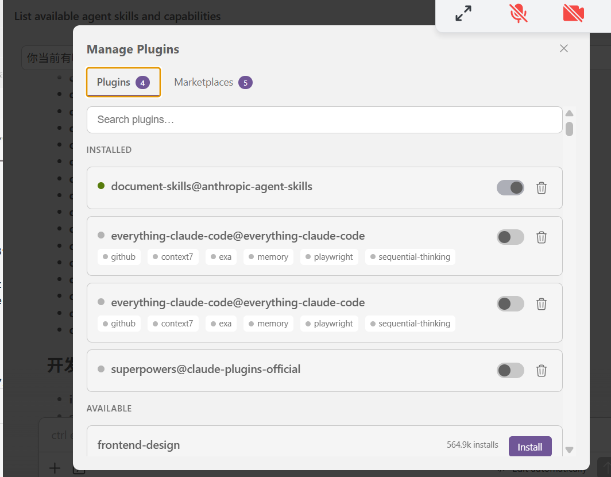

## 引言

随着人工智能技术的快速发展，AI辅助编程（Vibe Coding）已成为现代软件开发的重要趋势。本文将汇总优质的AI编程学习资源，并详细介绍Claude Code的安装与使用实践，帮助开发者更好地利用大模型提升开发效率。

## 1. 学习资源推荐

### 1.1 CS146S: The Modern Software Developer

**斯坦福大学课程** - 这门课程系统介绍了大模型的算法基础、提示词优化技巧，以及如何通过大模型提升软件开发效率的各种范式。

- **课程官网**: [themodernsoftware.dev](https://themodernsoftware.dev/)
- **主要内容**: 从算法原理到实际应用，涵盖大模型在软件开发中的各个方面
- **适用人群**: 希望系统学习AI辅助编程的开发者
- **课程特色**: 
  - 理论与实践相结合
  - 涵盖最新的AI编程范式
  - 提供实际项目案例

### 1.2 PSPDFKit创始人分享

openclaw（PSPDFKit创始人）关于AI编程的深度分享

- **分享重点**: AI在软件开发中的实践经验、工具选择和团队协作
- **价值**: 来自一线创业者的实战经验分享
- **核心观点**:
  - AI工具如何融入现有开发流程
  - 团队协作中的最佳实践
  - 生产力提升的实际案例

### 1.3 吴恩达：Agent Skills with Anthropic

**DeepLearning.AI短期课程** - 由吴恩达团队与Anthropic合作推出的智能体技能课程。

- **课程链接**: [Agent Skills with Anthropic](https://www.deeplearning.ai/short-courses/agent-skills-with-anthropic/)
- **课程特色**: 专注于构建和优化AI智能体，提升与Claude等大模型的交互能力
- **学习收获**:
  - 掌握智能体设计原理
  - 学习提示工程高级技巧
  - 了解系统集成方法

## 2. Claude Code工具生态

### 2.1 Claude Code简介

Claude Code是Anthropic推出的命令行AI编程助手，支持多种编程语言和开发环境，能够显著提升开发效率。

### 2.2 社区资源汇总

#### 2.2.1 Everything Claude Code
- **GitHub仓库**: [affaan-m/everything-claude-code](https://github.com/affaan-m/everything-claude-code)
- **内容**: Claude Code的全面使用指南和技巧分享
- **特色**: 
  - 安装配置指南
  - 高级功能详解
  - 常见问题解答

#### 2.2.2 Superpowers
- **GitHub仓库**: [obra/superpowers](https://github.com/obra/superpowers)
- **内容**: 扩展Claude Code功能的工具和插件集合
- **特色**:
  - 自定义技能开发
  - 工作流优化工具
  - 社区插件集合

## 3. Claude Code安装与配置

### 3.1 Windows系统安装

```bash
# 使用Windows包管理器安装
winget install Anthropic.ClaudeCode

# 验证安装
claude --version

# 启动Claude Code
claude code
```

**官方仓库**: [anthropics/claude-code](https://github.com/anthropics/claude-code)

### 3.2 WSL (Windows Subsystem for Linux) 安装

```bash
# 1. 查找Windows中的Claude Code安装位置
which claude.exe 2>/dev/null || ls /mnt/c/Users/maozhihao-jk/AppData/Roaming/npm/claude*

# 2. 清理可能存在的错误别名
sed -i "/alias claude='claude.exe'/d" ~/.bashrc

# 3. 添加正确的别名到bash配置文件
echo "alias claude='/mnt/c/Users/maozhihao-jk/AppData/Roaming/npm/claude'" >> ~/.bashrc

# 4. 重新加载配置文件
source ~/.bashrc

# 5. 验证安装
claude --version

# vscode共用一套配置
rm -rf ~/.claude
rm ~/.claude.json

# 软链接到 Windows 的配置
ln -s /mnt/c/Users/maozhihao-jk/.claude ~/.claude
ln -s /mnt/c/Users/maozhihao-jk/.claude.json ~/.claude.json


```

### 3.3 vscode的claude code和终端中的claude code的差异
```
Windows 终端 claude
        ↓
  读 C:\Users\maozhihao-jk\.claude\     ← 同一份配置
        ↑
Windows VSCode 插件


WSL 终端 claude
        ↓
  读 /root/.claude\                      ← 同一份配置
        ↑
WSL VSCode 插件（远程连接到 WSL 时）
```


### 3.4 cc-switch工具安装

cc-switch是一个用于在Claude Code中快速切换模型和配置的工具，特别适合使用国产API的用户。

```bash
# 安装cc-switch
# 请参考官方仓库的安装说明
```

- **官方仓库**: [farion1231/cc-switch](https://github.com/farion1231/cc-switch)
- **主要功能**:
  - 快速切换不同模型配置
  - 管理多个API端点
  - 简化配置管理


cc-switch中代理的配置的含义：cc-swith中的代理不等于翻墙的代理，它是将从官方 api.anthropic.com 切换到另一个地址（比如 ModelArts），让你在国内不翻墙也能用 Claude。

## 4. VS Code集成与技能使用

### 4.1 VS Code扩展安装

在VS Code中使用Claude Code的技能功能，可以通过以下方式集成：

1. **安装VS Code扩展**: 搜索并安装Claude Code相关扩展
2. **配置技能目录**: 设置Claude Code的技能路径
3. **启用技能**: 在VS Code中启用Claude Code技能支持

### 4.2 vscode-cc-switch集成指南

- **详细安装指南**: [Golden-Promise/vscode-cc-switch](https://github.com/Golden-Promise/vscode-cc-switch)
- **功能特点**:
  - VS Code界面集成
  - 一键切换配置
  - 可视化配置管理


### 4.3 常用技能目录结构

```
.claude/
├── skills/          # 自定义技能目录
│   ├── git/         # Git相关技能
│   ├── web/         # Web开发技能
│   └── ai/          # AI相关技能
├── plugins/         # 插件目录
└── config/          # 配置文件目录
```
### 常用插件
# 将此仓库添加为市场
/plugin marketplace add https://github.com/affaan-m/everything-claude-code
# 安装插件
/plugin install everything-claude-code@everything-claude-code
claude plugin install superpowers

claude plugin marketplace add anthropics/skills
claude plugin install document-skills@anthropic-agent-skills


## 5. 最佳实践与工作流
### 5.0 如何使用skills
/skills 请你描述xxxxxx


### vscode中如何查看并配置plugins



### 5.1 学习路径建议

1. **基础学习**: 从CS146S等课程建立理论基础
2. **工具掌握**: 学习Claude Code等工具的基本使用
3. **实践应用**: 在实际项目中应用AI辅助编程
4. **优化迭代**: 根据经验优化个人工作流

### 5.2 开发工作流优化

- **代码审查**: 使用Claude Code进行代码质量检查
- **重构辅助**: 利用AI工具进行代码重构
- **文档生成**: 自动生成代码注释和文档
- **调试支持**: AI辅助的问题诊断和解决

### 5.3 团队协作建议

1. **统一工具链**: 团队使用相同的AI辅助工具
2. **共享配置**: 建立团队共享的配置和技能库
3. **经验分享**: 定期交流AI编程的最佳实践
4. **持续学习**: 关注AI编程领域的最新发展

## 6. 总结

AI辅助编程正在深刻改变软件开发的方式。通过系统学习相关理论、掌握实用工具，并在实际项目中不断实践，开发者可以显著提升编码效率和质量。

**关键要点**:

1. **理论学习是基础** - 理解AI编程的原理和范式
2. **工具熟练是关键** - 掌握Claude Code等核心工具
3. **实践应用是核心** - 在真实项目中积累经验
4. **持续优化是保障** - 根据反馈不断改进工作流

随着AI技术的不断发展，AI辅助编程将成为每个开发者的必备技能。建议从现在开始系统学习，逐步建立适合自己的AI编程工作流。

---

**更新记录**:
- 2026-04-20: 初版发布，整合AI编程资源与Claude Code实践指南
- 计划更新: 补充更多实战案例和高级技巧