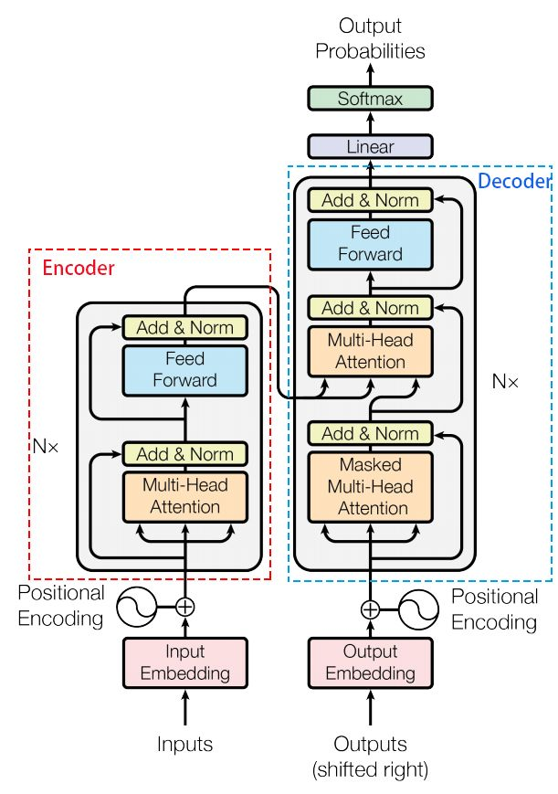
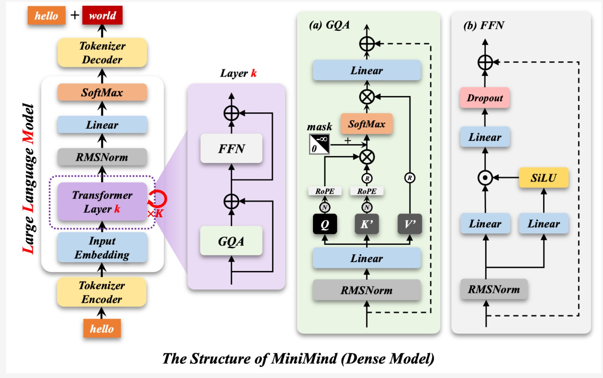
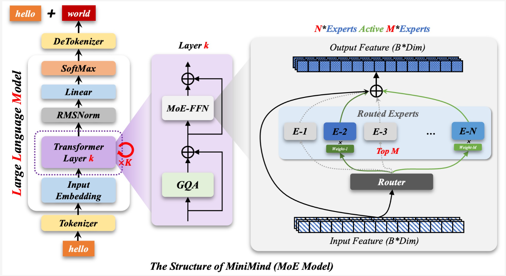

# MiniMind 模型架构与预训练技术解读

## 1. Tokenizer（分词器）

### 1.1 Tokenizer 基础用法

```python
# 编码：文字转数字
input_ids = tokenizer.encode('Hello World!', return_tensors='pt')

# 生成任务
output = model.generate(input_ids, max_length=50)  # output 是数字序列

# 解码：数字转文字
decoded_text = tokenizer.decode(output[0])
```

### 1.2 Tokenizer 工作原理

Tokenzier 将 token 序列编码成整数序列后，不需要再变成 one-hot 向量，而是直接通过 `nn.Embedding` 映射为稠密向量。`nn.Embedding` 是直接根据索引查表，不需要做矩阵乘法。

### 1.3 学习资源

- [从词到数：Tokenizer与Embedding串讲 - Hao Bai的文章](https://zhuanlan.zhihu.com/p/631463712)
- [HuggingFace Transformers Tokenizer 文档](https://huggingface.co/docs/transformers/tokenizer_summary)

## 2. Attention 机制

### 2.1 KV Cache 优化

Attention 机制中的 KV Cache 优化对于提升推理效率至关重要：

- **MHA（Multi-Head Attention）**：多头注意力
- **MQA（Multi-Query Attention）**：多查询注意力
- **GQA（Grouped-Query Attention）**：分组查询注意力
- **MLA（Multi-Layer Attention）**：多层注意力

#### 学习资源

[KV Cache（一）：从KV Cache看懂Attention优化 - 陈碎的文章](https://zhuanlan.zhihu.com/p/1991144335056597424)

## 3. Transformer Block 结构

Transformer 中的一个基本 block 结构公式：

```
Output = LayerNorm(Input + FFN(Input))
```

其中：
- **LayerNorm**：层归一化
- **FFN**：前馈神经网络
- **+**：残差连接
  
## transformer 示意图




### 学习资源
[Transformer模型详解（图解最完整版）](https://zhuanlan.zhihu.com/p/338817680)


## 4. MiniMind 模型架构

### 4.1 MiniBlock 结构

MiniMind 模型的核心组件是 MiniBlock，其结构如下图所示：





### 4.2 MiniBlock 代码实现

```python
class MiniMindBlock(nn.Module):
    """MiniMind 模型的核心块结构"""
    
    def __init__(self, layer_id: int, config: MiniMindConfig):
        super().__init__()
        
        # 自注意力机制
        self.self_attn = Attention(config)
        
        # 层归一化
        self.input_layernorm = RMSNorm(config.hidden_size, eps=config.rms_norm_eps)
        self.post_attention_layernorm = RMSNorm(config.hidden_size, eps=config.rms_norm_eps)
        
        # MLP 或 MoE 前馈网络
        if not config.use_moe:
            self.mlp = FeedForward(config)
        else:
            self.mlp = MOEFeedForward(config)
    
    def forward(self, hidden_states, attention_mask=None):
        # 前向传播逻辑
        # 1. 输入层归一化
        # 2. 自注意力计算
        # 3. 残差连接
        # 4. 后注意力层归一化
        # 5. MLP/MoE 前馈网络
        # 6. 最终残差连接
        pass
```

### 4.3 架构特点

1. **RMSNorm**：使用 RMSNorm 替代传统的 LayerNorm
2. **注意力机制**：支持多种注意力优化
3. **MoE 支持**：可选的混合专家前馈网络
4. **残差连接**：每个子层后都有残差连接

## 5. 预训练关键技术

### 5.1 数据预处理
- Tokenizer 配置与优化
- 数据集清洗与过滤
- 序列长度处理

### 5.2 训练策略
- 学习率调度
- 优化器选择（AdamW 等）
- 梯度累积与 clipping

### 5.3 评估指标
- Perplexity（困惑度）
- 下游任务 zero-shot 性能
- 推理效率（token/s）

---

**本文持续更新中...**
