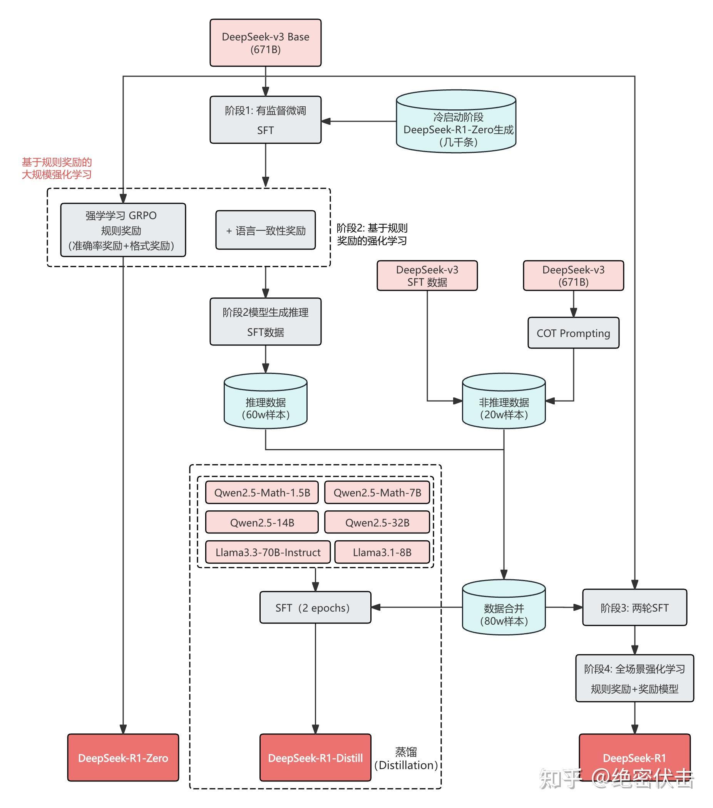

# 注意力机制
超细图解MLA计算流&吸收矩阵对比分析 - kaiyuan的文章 - 知乎
https://zhuanlan.zhihu.com/p/1948769945132470860


# kv cache 等 

从零实现一个玩具版LLM推理引擎（一）：用最简单代码彻底搞懂 Pre-fill、Decode 和 KV Cache - superjet的文章 - 知乎
https://zhuanlan.zhihu.com/p/2018242525970835129


# deepseek 系列

| 技术创新                                                                                         | 模型版本               | 发布时间   |
| :----------------------------------------------------------------------------------------------- | :--------------------- | :--------- |
| Deepseek MoE 架构                                                                                | DeepSeek-MOE[1]        | 2024年1月  |
| Group Relative Policy Optimization (GRPO，群体相对策略优化)                                      | DeepSeek-Math[2]       | 2024年4月  |
| Multi-Head Latent Attention (MLA，多头隐式注意力)                                                | DeepSeek-V2[3]         | 2024年6月  |
| Multi-Token Prediction (MTP，多令牌预测)                                                         | DeepSeek-V3[4]         | 2024年12月 |
| AI Infra相关（以训练加速为主，如FP8混合精度训练、DualPipe+等）                                   | DeepSeek-V3[4]         | 2024年12月 |
| 通过强化学习显著提升模型推理能力，R1-Zero在AIME 2024等推理基准测试中达到OpenAI-o1-0912的水平     | DeepSeek-R1-Zero[5]    | 2025年1月  |
| 使用冷启动-强化学习（推理场景）-SFT-强化学习（全场景）四阶段训练，R1模型达到OpenAI-o1-1217的水平 | DeepSeek-R1[5]         | 2025年1月  |
| 将R1推理能力蒸馏到小的稠密模型                                                                   | DeepSeek-R1-Distill[5] | 2025年1月  |

## deepseek v3


## deepseek_r1



冷启动 ----

消融实验--控制变量

拒绝采样--**“大批量试镜 ➡️ 严格打分 ➡️ 留下优秀的，拒绝差的”的过程，就是** **拒绝采样** **。**

DeepSeek关键技术详解 - 腾讯技术工程的文章 - 知乎
https://zhuanlan.zhihu.com/p/23048347789

DeepSeek-R1 技术报告解读 - 绝密伏击的文章 - 知乎
https://zhuanlan.zhihu.com/p/19868935152  

https://arxiv.org/abs/2501.12948


## deepseek_V4

https://huggingface.co/deepseek-ai/DeepSeek-V4-Pro/blob/main/DeepSeek_V4.pdf

[桔了个仔的回答 - 知乎](https://www.zhihu.com/question/2030963929510310856/answer/2030972531839124459)

# qwen3.5

```
(APIServer pid=63128) INFO 06-05 15:47:35 [loggers.py:271] Engine 000: Avg prompt throughput: 43.4 tokens/s, Avg generation throughput: 6.1 tokens/s, Running: 1 reqs, Waiting: 0 reqs, GPU KV cache usage: 1.6%, Prefix cache hit rate: 0.0%
```

prefix cache hit 是滑动窗口取的一段时间的均值
